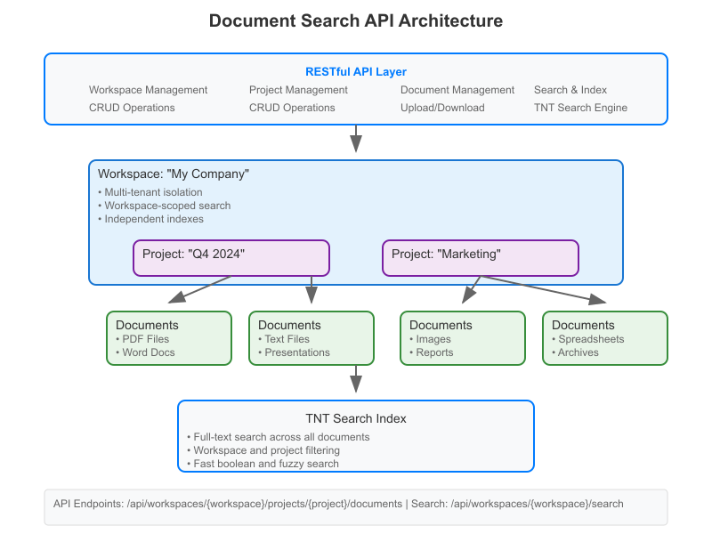

# Document Search API Engine

A Laravel-based document search API engine using TNT Search for fast full-text search capabilities. Features workspace and project management for organized document collections.

> ⚠️ **WARNING: DEVELOPMENT STATUS**⚠️ 
> 
> This package is currently under active development and is **NOT READY FOR PRODUCTION USE**. 
> 
> Features may be incomplete, APIs might change, and there could be breaking changes. Use at your own risk in development environments only.

## Features

- **Workspace Management**: Multi-tenant workspace organization
- **Project Management**: Organize documents into projects within workspaces
- **Document Upload**: Support for PDF, DOC, DOCX, and TXT files
- **Full-Text Search**: Fast search using TNT Search engine
- **Document Management**: Complete CRUD operations for documents
- **Search Snippets**: Highlighted search results with context
- **Advanced Search**: Filtering by file type, date range, project, and sorting options
- **Search Suggestions**: Auto-complete functionality
- **Index Management**: Tools for rebuilding and maintaining search indexes
- **OpenAPI Documentation**: Complete API documentation with Swagger UI

## Architecture Overview

The API is organized around three main entities:

- **Workspaces**: Top-level containers that provide tenant isolation
- **Projects**: Collections of related documents within a workspace
- **Documents**: Individual files with extracted content and metadata



## Quick Start

### 1. Installation

```bash
# Install dependencies
composer install

# Set up environment
cp .env.example .env
php artisan key:generate

# Run migrations
php artisan migrate

# Create search index
php artisan search:create-index

# Start development server
php artisan serve
```

### 2. API Documentation

Visit `http://localhost:8000/api/documentation` to access the interactive Swagger UI with complete API documentation.

### 3. Test Interface

A simple test interface is available at `http://localhost:8000/test` for trying out the API endpoints.

### 4. API Endpoints

#### Workspace Management

| Method | Endpoint | Description |
|--------|----------|-------------|
| GET | `/api/workspaces` | List all workspaces |
| POST | `/api/workspaces` | Create a new workspace |
| GET | `/api/workspaces/{workspace}` | Get workspace details |
| PUT | `/api/workspaces/{workspace}` | Update workspace |
| DELETE | `/api/workspaces/{workspace}` | Delete workspace |

#### Project Management

| Method | Endpoint | Description |
|--------|----------|-------------|
| GET | `/api/workspaces/{workspace}/projects` | List projects in workspace |
| POST | `/api/workspaces/{workspace}/projects` | Create project in workspace |
| GET | `/api/workspaces/{workspace}/projects/{project}` | Get project details |
| PUT | `/api/workspaces/{workspace}/projects/{project}` | Update project |
| DELETE | `/api/workspaces/{workspace}/projects/{project}` | Delete project |
| GET | `/api/workspaces/{workspace}/projects/{project}/statistics` | Get project statistics |

#### Document Management

| Method | Endpoint | Description |
|--------|----------|-------------|
| POST | `/api/workspaces/{workspace}/documents` | Upload and index a document |
| GET | `/api/workspaces/{workspace}/documents` | List documents in workspace |
| GET | `/api/workspaces/{workspace}/documents/{id}` | Get specific document details |
| PUT | `/api/workspaces/{workspace}/documents/{id}` | Update document metadata |
| DELETE | `/api/workspaces/{workspace}/documents/{id}` | Delete document and remove from index |
| GET | `/api/workspaces/{workspace}/documents/{id}/download` | Download document file |
| GET | `/api/workspaces/{workspace}/documents-statistics` | Get document statistics |

#### Search Operations

| Method | Endpoint | Description |
|--------|----------|-------------|
| GET | `/api/workspaces/{workspace}/search` | Basic document search |
| POST | `/api/workspaces/{workspace}/search/advanced` | Advanced search with filters |
| GET | `/api/workspaces/{workspace}/search/suggestions` | Get search suggestions |

#### Index Management

| Method | Endpoint | Description |
|--------|----------|-------------|
| GET | `/api/workspaces/{workspace}/index/status` | Get search index status |
| POST | `/api/workspaces/{workspace}/index/rebuild` | Rebuild entire search index |

## Usage Examples

### Create a Workspace

```bash
curl -X POST http://localhost:8000/api/workspaces \
  -H "Content-Type: application/json" \
  -d '{
    "name": "My Company",
    "slug": "my-company",
    "description": "Main workspace for company documents"
  }'
```

### Create a Project

```bash
curl -X POST http://localhost:8000/api/workspaces/my-company/projects \
  -H "Content-Type: application/json" \
  -d '{
    "name": "Q4 2024 Reports",
    "description": "Quarterly financial and business reports",
    "color": "#007bff"
  }'
```

### Upload a Document to a Project

```bash
curl -X POST http://localhost:8000/api/workspaces/my-company/documents \
  -F "file=@annual-report.pdf" \
  -F "title=Annual Report 2024" \
  -F "project_id=1" \
  -F "description=Company annual financial report"
```

### Search Documents in a Workspace

```bash
curl -X GET "http://localhost:8000/api/workspaces/my-company/search?q=revenue+growth&page=1&per_page=10"
```

### Advanced Search with Project Filter

```bash
curl -X POST http://localhost:8000/api/workspaces/my-company/search/advanced \
  -H "Content-Type: application/json" \
  -d '{
    "query": "financial performance",
    "filters": {
      "project_id": 1,
      "file_type": ["pdf", "docx"],
      "date_from": "2024-01-01",
      "date_to": "2024-12-31"
    },
    "sort": "date_desc",
    "page": 1,
    "per_page": 20
  }'
```

### Get Project Statistics

```bash
curl -X GET http://localhost:8000/api/workspaces/my-company/projects/q4-2024-reports/statistics
```

## Supported File Types

- **PDF** (.pdf) - Portable Document Format
- **Microsoft Word** (.doc, .docx) - Word documents
- **Plain Text** (.txt) - Text files

## Configuration

### Environment Variables

```bash
# Search Configuration
SCOUT_DRIVER=tntsearch
SCOUT_QUEUE=true

# TNT Search Configuration
TNTSEARCH_FUZZINESS=true
TNTSEARCH_BOOLEAN=true
TNTSEARCH_MAX_DOCS=1000

# API Documentation
L5_SWAGGER_GENERATE_ALWAYS=false
L5_SWAGGER_CONST_HOST=localhost:8000
```

## Testing

Run the test suite to ensure everything is working correctly:

```bash
# Run all tests
php artisan test

# Run specific test suites
php artisan test --testsuite=Feature
php artisan test --testsuite=Unit

# Run with coverage (requires Xdebug)
php artisan test --coverage
```

## API Documentation

The API documentation is generated using L5-Swagger and follows OpenAPI 3.0 specification:

- **Interactive Documentation**: Visit `/api/documentation` for Swagger UI
- **JSON Schema**: Available at `/api/documentation.json`
- **Regenerate Docs**: Run `php artisan l5-swagger:generate`

## Troubleshooting

### Common Issues

1. **Search returns empty results**
   - Run `php artisan search:create-index` to rebuild index
   - Check that documents are properly indexed

2. **File upload fails**
   - Verify file size is under 10MB limit
   - Check file type is supported
   - Ensure storage directories are writable

3. **Workspace middleware issues**
   - Verify workspace slug exists in the database
   - Check route parameters match middleware expectations

4. **Test failures**
   - Ensure test database is properly configured
   - Run `php artisan migrate:fresh` in test environment
   - Check that required services (TNT Search) are available

For detailed implementation information, see the API documentation at `/api/documentation`.

---

## About Laravel

Laravel is a web application framework with expressive, elegant syntax. We believe development must be an enjoyable and creative experience to be truly fulfilling. Laravel takes the pain out of development by easing common tasks used in many web projects, such as:

- [Simple, fast routing engine](https://laravel.com/docs/routing).
- [Powerful dependency injection container](https://laravel.com/docs/container).
- Multiple back-ends for [session](https://laravel.com/docs/session) and [cache](https://laravel.com/docs/cache) storage.
- Expressive, intuitive [database ORM](https://laravel.com/docs/eloquent).
- Database agnostic [schema migrations](https://laravel.com/docs/migrations).
- [Robust background job processing](https://laravel.com/docs/queues).
- [Real-time event broadcasting](https://laravel.com/docs/broadcasting).

Laravel is accessible, powerful, and provides tools required for large, robust applications.

## Learning Laravel

Laravel has the most extensive and thorough [documentation](https://laravel.com/docs) and video tutorial library of all modern web application frameworks, making it a breeze to get started with the framework.

You may also try the [Laravel Bootcamp](https://bootcamp.laravel.com), where you will be guided through building a modern Laravel application from scratch.

If you don't feel like reading, [Laracasts](https://laracasts.com) can help. Laracasts contains thousands of video tutorials on a range of topics including Laravel, modern PHP, unit testing, and JavaScript. Boost your skills by digging into our comprehensive video library.

## Laravel Sponsors

We would like to extend our thanks to the following sponsors for funding Laravel development. If you are interested in becoming a sponsor, please visit the [Laravel Partners program](https://partners.laravel.com).

### Premium Partners

- **[Vehikl](https://vehikl.com)**
- **[Tighten Co.](https://tighten.co)**
- **[Kirschbaum Development Group](https://kirschbaumdevelopment.com)**
- **[64 Robots](https://64robots.com)**
- **[Curotec](https://www.curotec.com/services/technologies/laravel)**
- **[DevSquad](https://devsquad.com/hire-laravel-developers)**
- **[Redberry](https://redberry.international/laravel-development)**
- **[Active Logic](https://activelogic.com)**

## Contributing

Thank you for considering contributing to the Laravel framework! The contribution guide can be found in the [Laravel documentation](https://laravel.com/docs/contributions).

## Code of Conduct

In order to ensure that the Laravel community is welcoming to all, please review and abide by the [Code of Conduct](https://laravel.com/docs/contributions#code-of-conduct).

## Security Vulnerabilities

If you discover a security vulnerability within Laravel, please send an e-mail to Taylor Otwell via [taylor@laravel.com](mailto:taylor@laravel.com). All security vulnerabilities will be promptly addressed.

## License

The Laravel framework is open-sourced software licensed under the [MIT license](https://opensource.org/licenses/MIT).
